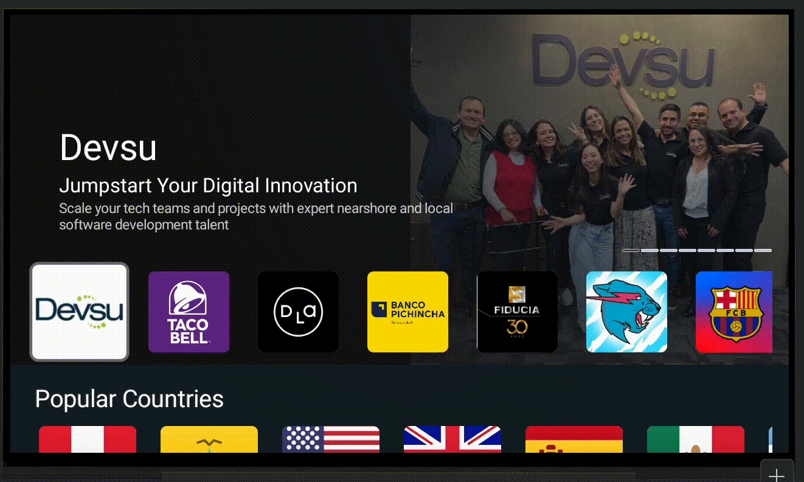

<h3 align="center">Multi Module with Android TV and Compose</h3>

<div align="center">

  []() 
   
  
  [](https://github.com/nowjordanhappy/MultiModuleCleanArchicture/issues)
  [](https://github.com/nowjordanhappy/MultiModuleCleanArchicture/pulls)
  [](/LICENSE)
  
  <a href="https://www.buymeacoffee.com/nowjordanhappy" target="_blank"></a>
</div>

# Multi Module Clean Architecture (Android TV)

This android project gives an example about how to use shared modules for two platforms: mobile and tv. And also to make a coexisting project with xml and compose for the UI.

This project shows an app fetching movies from an API and show them in a list.

| Mobile      | TV |
| ----------|-----------|
|  |  |


And now also list of radio channels and list of Popular YouTube Channels. 

| Streaming Demo Video (YouTube)      | Streaming Demo Radio |
| ----------|-----------|
|  |  |


## Table of Contents
- [Multi Module Clean Architecture (Android TV)](#multi-module-clean-architecture-android-tv)
  - [Table of Contents](#table-of-contents)
  - [Modules](#modules)
  - [API Reference Movie](#api-reference-movie)
      - [Fetch Now Playing Movies](#api-reference-movie/fetch-now-playing-movies)
  - [Movie Module](#movie-module)
      - [Data](#movie-module/data)
      - [Domain](#movie-module/domain)
      - [UI Mobile](#movie-module/ui-mobile)
      - [UI Tv](#movie-module/ui-tv)
  - [App Module](#app-module)
    - [Flavors](#app-module/flavors)
    - [Manifests](#app-module/manifests)
      - [Mobile](#app-module/manifests/mobile)
      - [TV](#app-module/manifests/tv)
  - [Gradle in Multi Modules](#gradle-in-multi-modules)
    - [Dependencies for Movie Module](#gradle-in-multi-modules/dependencies-for-movie-module)
      - [Domain](#gradle-in-multi-modules/dependencies-for-movie-module/domain)
      - [Data](#gradle-in-multi-modules/dependencies-for-movie-module/data)
      - [Presentation - Mobile](#gradle-in-multi-modules/dependencies-for-movie-module/presentation-mobile)
      - [Presentation - TV](#gradle-in-multi-modules/dependencies-for-movie-module/presentation-tv)
  - [Streaming Module](#streaming-module) 
    - [YouTube Data API v3](#streaming-module/youtube-data-api) 
        - [Search Videos By Channel](#api-reference-movie/search-videos-by-channel)
    - [Radio Browser API](#streaming-module/radio-browser-api) 
        - [Search Radio List](#api-reference-movie/search-radio-list)
    - [YouTube Player](#streaming-module/youtube-player) 
  - [Tests](#tests)
  - [Why Android TV?](#why-android-tv)
  - [Why Jetpack Compose?](#why-jetpack-compose)
  - [Android Studio](#android-studio)
  - [Author](#author)
  - [License](#license)


## Modules<a name = "modules"></a>
The project has the following modules:

- **app**: main module of the project
- **core**: module for shared libraries/resources not related to UI
- **core-ui**: module for shared libraries/resources related to **UI**
- **movie**: module for the feature movie
  - **movie-data**
  - **movie-domain**
  - **movie-ui**
    - **movie-ui-mobile**
    - **movie-ui-tv**
- **navigation**
- **preferences**
- **streaming**
  - **streaming-data**
  - **streaming-domain**
  - **streaming-ui** 

## API Reference Movie <a name = "api-reference-movie"></a>
Using [The Movie Database API](https://developer.themoviedb.org/reference/intro/getting-started) for this project.

#### Fetch Now Playing Movies<a name = "api-reference-movie/fetch-now-playing-movies"></a>
```
    URL BASE: https://api.themoviedb.org/3/
```
```http
    GET movie/now_playing
```

| Parameter | Type     | Description                       |
| :-------- | :------- | :-------------------------------- |
| `language`      | `String` | **Required** |
| `page`      | `Int` | **Required**|

## Movie Module<a name = "movie-module"></a>
This module encapsulates all features related to "movie", in case after I need to add another one. And it 

- **movie-data**: works as the data layer for the feature "movie". it manages data storage, fetching data and network operations. 
- **movie-domain**: contains the bussiness logic and rules of the app (use cases). This module connects the UI and data modules (layers).
- **movie-ui**: contains the presentation and interaction with the user
    - **movie-ui-mobile**: uses **XML** for design and implements views related to mobile platform
    - **movie-ui-tv**: uses **Jetpack Compose** for design and implements views related to TV platform

The project is using DaggerHilt for dependency injection, every module provides different dependencies.

#### Data<a name = "movie-module/data"></a>
    
Provides these classes:

        - MovieDataModule
        - OAuthInterceptor
        - MovieApi
        - NowPlayingMovieListResponse
        - MovieRepositoryImpl
        - MovieDtoMapper


#### Domain<a name = "movie-module/domain"></a>
    
Provides these classes:

        - MovieDomainModule
        - Movie
        - MovieRepository
        - GetNowPlayingMovies

#### UI Mobile<a name = "movie-module/ui_mobile"></a>
    
Provides these classes (using Jetpack Compose):

        - MovieListItem
        - Movie
        - MovieListScreen
        - MovieListState
        - MovieListViewModel

#### UI Tv<a name = "movie-module/ui_tv"></a>
    
Provides these classes (using XML):

        - MoviePresenter
        - ErrorFragment
        - MovieListFragment
        - SpinnerFragment
        - MovieListEvent
        - MovieListViewModel

    
## App Module<a name = "app-module"></a>
This module uses the previous modules and configures two flavors to separate one version for mobile and one for TV.

### Flavors<a name = "app-module/flavors"></a>

| Flavor |  Description                       |
| :-------- | :-------------------------------- |
| `mobile`      |  Flavor for **mobile** platform |
| `tv`      | Flavor for **tv** platform|
| `streaming`      | Flavor for **tv streming**: radio and video streaming |

```kotlin
    flavorDimensions("platform")

    productFlavors {
        create("mobile") {
            dimension = "platform"
        }

        create("tv") {
            dimension = "platform"
        }

        create("streaming") {
            dimension = "platform"
            applicationIdSuffix = ".streaming"
        }
    }


    sourceSets {
        getByName("mobile") {
            manifest.srcFile("src/mobile/AndroidManifest.xml")
        }
        getByName("tv") {
            manifest.srcFile("src/tv/AndroidManifest.xml")
        }
        getByName("streaming") {
            manifest.srcFile("src/streaming/AndroidManifest.xml")
        }
    }
```

### Manifests<a name = "app-module/manifests"></a>
Here the only difference is that TV manifest use Leanback Launcher:

#### Mobile

```xml
    <intent-filter>
        <action android:name="android.intent.action.MAIN" />
        <category android:name="android.intent.category.LAUNCHER" />
    </intent-filter>
```

#### TV

```xml
    <intent-filter>
        <action android:name="android.intent.action.MAIN" />
        <category android:name="android.intent.category.LEANBACK_LAUNCHER" />
    </intent-filter>
```


## Gradle in Multi Modules<a name = "gradle-in-multi-modules"></a>
This project has two base gradle files to implement in other modules:


- Base Module Gradle: 

    Includes all needed dependencies for module that doesn't use or required UI or android libraries

        base-module.gradle
    

- Compose Module Gradle: 

    Includes all needed dependencies for module that use Jetpack Compose

        compose-module.gradle

- No Compose Module Gradle: 

    Includes all needed dependencies for module that doesn't use Jetpack Compose, and use XML for designing views. For this project, includes Leanback for Android TV libraries.

        no-compose-module.gradle


### Dependencies for Movie Module:<a name = "gradle-in-multi-modules/dependencies-for-movie-module"></a>
#### Domain: <a name = "gradle-in-multi-modules/dependencies-for-movie-module/domain"></a>
```kotlin
import com.devsu.buildsrc.Modules

apply {
    from("$rootDir/movie-domain-module.gradle")
}

dependencies {
    "implementation"(project(Modules.core))
    "implementation"(project(Modules.coreUi))
}

```
#### Data: <a name = "gradle-in-multi-modules/dependencies-for-movie-module/data"></a>
```kotlin
import com.devsu.buildsrc.Modules
import com.devsu.buildsrc.Retrofit

apply {
    from("$rootDir/movie-data-module.gradle")
}

dependencies {
    "implementation"(project(Modules.core))
    "implementation"(project(Modules.coreUi))
    "implementation"(project(Modules.movieDomain))

    "implementation"(platform(Retrofit.okHttpBmo))
    "implementation"(Retrofit.okHttp)
    "implementation"(Retrofit.okHttpLoggingInterceptor)
    "implementation"(Retrofit.retrofit)
    "implementation"(Retrofit.gsonConverter)
}
```

#### Presentation - Mobile: <a name = "gradle-in-multi-modules/dependencies-for-movie-module/presentation-mobile"></a>
```kotlin
import com.devsu.buildsrc.Modules
import com.devsu.buildsrc.Coil
import com.devsu.buildsrc.DaggerHilt

apply {
    from("$rootDir/movie-ui-mobile-module.gradle")
}

dependencies {
    "implementation"(project(Modules.core))
    "implementation"(project(Modules.coreUi))
    "implementation"(project(Modules.movieDomain))

    "implementation"(Coil.coilCompose)
}

```

#### Presentation - TV: <a name = "gradle-in-multi-modules/dependencies-for-movie-module/presentation-tv"></a>
```kotlin
import com.devsu.buildsrc.Modules
import com.devsu.buildsrc.Coil

apply {
    from("$rootDir/movie-ui-tv-module.gradle")
}

dependencies {
    "implementation"(project(Modules.core))
    "implementation"(project(Modules.coreUi))
    "implementation"(project(Modules.movieDomain))

    "implementation"(Coil.coilKotlin)
}
```

## Streaming Module<a name = "streaming-module"></a> 
This module tries to simulate how will be implementing a video and radio streaming using YouTube API and also a free API called [Radio Browser](https://www.radio-browser.info/). And also the main goal is use [Jetpack Compose for Android TV](https://developer.android.com/training/tv/playback/compose).

All views in this module are using Jetpack Compose for Android TV.

### YouTube Data API v3<a name = "streaming-module/youtube-data-api"></a>
For this case, we will have the channels id list in the app, and we will use it to get the video ids and show the video. You need to get your API in Google Cloud Console. Find more information [here](https://developers.google.com/youtube/v3/getting-started).

#### Search Videos By Channel<a name = "api-reference-movie/search-videos-by-channel"></a>

```
    URL BASE: https://www.googleapis.com/youtube/v3/
```
```http
    GET search
```

| Parameter | Type     | Description                       |
| :-------- | :------- | :-------------------------------- |
| `key`      | `String` | **Required** |
| `channelId`      | `String` | **Required**|
| `part`      | `String` | |
| `order`      | `String` | |
| `order`      | `String` | |
| `maxResults`      | `String` | |


### Radio Browser API v3<a name = "streaming-module/radio-browser-api"></a>
This is a free API we are using to get list of radios by gender, country or most populars. Find more information [here](https://www.radio-browser.info).

#### Search Radio List<a name = "api-reference-movie/search-radio-list"></a>

```
    URL BASE: https://de1.api.radio-browser.info/
```
```http
    GET json/stations/search
```

| Parameter | Type     | 
| :-------- | :------- | 
| `limit`      | `Int` | 
| `offset`      | `Int` |
| `order`      | `String` | 
| `reverse`      | `Boolean` | 


### YouTube Player<a name = "streaming-module/youtube-player"></a>
According to the documentation, we can't use directly a Youtube Player because now it's deprecated, so now we need to handle it as a webview using iFrame. So to make it easier for this demo, I'm using [android-youtube-player](https://github.com/PierfrancescoSoffritti/android-youtube-player) to handle all the actions and loading the videos. This library is using kotlin, but we are going to use the view in Compose.


## Tests<a name = "tests"></a>

- Movie Domain
    - GetNowPlayingMoviesTest
- Movie Data
    - MovieDtoMapperTest
    - MovieApiTest

## Why Android TV? <a name = "why-android-tv"></a>
I did a previous example using multi modules but only for mobile using XML and compose, so I wanted to take this as a challenge and use another platform like Android TV.

## Why Jetpack Compose? <a name = "why-jetpack-compose"></a>
Just for fun. Jetpack Compose becomes more stable and it's easier and need less code to design views.


## Android Studio <a name = "android-studio"></a>

```
Android Studio Iguana | 2023.2.1 Patch 1
Build #AI-232.10300.40.2321.11567975, built on March 13, 2024
Runtime version: 17.0.9+0-17.0.9b1087.7-11185874 aarch64
VM: OpenJDK 64-Bit Server VM by JetBrains s.r.o.
macOS 14.5
GC: G1 Young Generation, G1 Old Generation
Memory: 2048M
Cores: 10
Metal Rendering is ON
Registry:
    ide.experimental.ui=true

Non-Bundled Plugins:
    org.sonarlint.idea (8.4.0.73538)
```
    
## Author <a name = "author"></a>

- Jordan Rojas ([@nowjordanhappy](https://github.com/nowjordanhappy))

## License <a name = "license"></a>

MIT License

Copyright (c) 2024 Jordan R. A.

THE SOFTWARE IS PROVIDED "AS IS", WITHOUT WARRANTY OF ANY KIND, EXPRESS OR  
IMPLIED, INCLUDING BUT NOT LIMITED TO THE WARRANTIES OF MERCHANTABILITY,  
FITNESS FOR A PARTICULAR PURPOSE AND NONINFRINGEMENT. IN NO EVENT SHALL THE  
AUTHORS OR COPYRIGHT HOLDERS BE LIABLE FOR ANY CLAIM, DAMAGES OR OTHER  
LIABILITY, WHETHER IN AN ACTION OF CONTRACT, TORT OR OTHERWISE, ARISING FROM,  
OUT OF OR IN CONNECTION WITH THE SOFTWARE OR THE USE OR OTHER DEALINGS IN THE  
SOFTWARE.