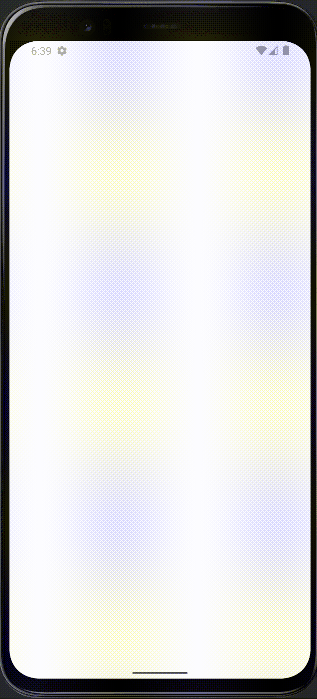
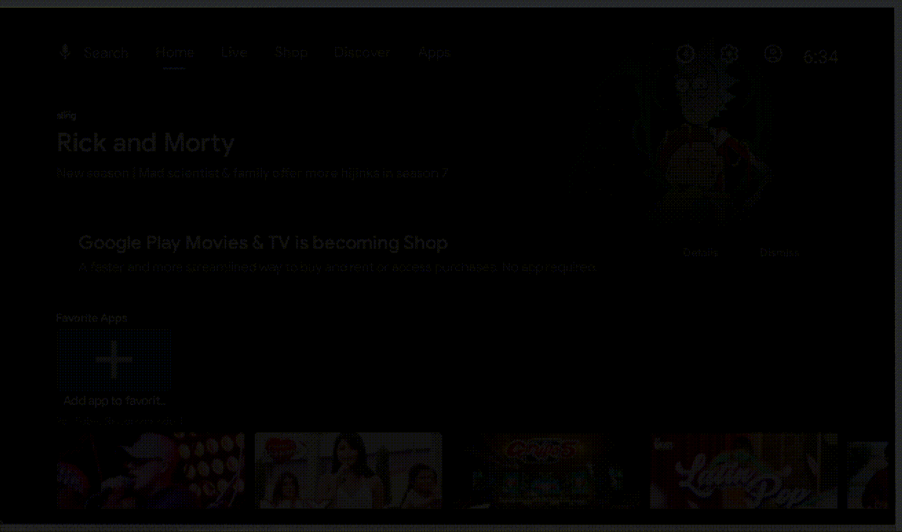

# MultiModuleCleanArchitecture
This android project gives an example about how to use shared modules for two platforms: mobile and tv. And also to make a coexisting project with xml and compose for the UI.

This project shows an app fetching movies from an API and show them in a list.

| Mobile      | TV |
| ----------|-----------|
|  |  |

## Modules
The project has the following modules:

- **app**: main module of the project
- **core**: module for shared libraries/resources not related to UI
- **core-ui**: module for shared libraries/resources related to **UI**
- **movie**: module for the feature movie
  - **movie-data**
  - **movie-domain**
  - **movie-ui**
    - **movie-ui-mobile**
    - **movie-ui-tv**

## API Reference Movie
Using [The Movie Database API](https://developer.themoviedb.org/reference/intro/getting-started) for this project.

#### Fetch Now Playing Movies
```
    URL BASE: https://api.themoviedb.org/3/
```
```http
    GET movie/now_playing
```

| Parameter | Type     | Description                       |
| :-------- | :------- | :-------------------------------- |
| `language`      | `String` | **Required** |
| `page`      | `Int` | **Required**|

## Movie Module
This module encapsulate all features related to "movie", in case after I need to add another one. And it 

- **movie-data**: works as the data layer for the feature "movie". it manages data storage, fetching data and network operations. 
- **movie-domain**: contains the bussiness logic and rules of the app (use cases). This module connects the UI and data modules (layers).
- **movie-ui**: contains the presentation and interaction with the user
    - **movie-ui-mobile**: uses **XML** for design and implements views related to mobile platform
    - **movie-ui-tv**: uses **Jetpack Compose** for design and implements views related to TV platform

The project is using DaggerHilt for dependency injection, every module provides different dependencies.

#### Data
    
Provides these classes:

        - MovieDataModule
        - OAuthInterceptor
        - MovieApi
        - NowPlayingMovieListResponse
        - MovieRepositoryImpl
        - MovieDtoMapper


#### Domain
    
Provides these classes:

        - MovieDomainModule
        - Movie
        - MovieRepository
        - GetNowPlayingMovies

#### UI Mobile
    
Provides these classes (using Jetpack Compose):

        - MovieListItem
        - Movie
        - MovieListScreen
        - MovieListState
        - MovieListViewModel

#### UI Tv
    
Provides these classes (using XML):

        - MoviePresenter
        - ErrorFragment
        - MovieListFragment
        - SpinnerFragment
        - MovieListEvent
        - MovieListViewModel

    
## App Module
This module use the previous modules and configures two flavors to separate one version for mobile and one for TV.

### Flavors

| Flavor |  Description                       |
| :-------- | :-------------------------------- |
| `mobile`      |  Flavor for **mobile** platform |
| `tv`      | Flavor for **tv** platform|

```kotlin
    flavorDimensions("platform")

    productFlavors {
        create("mobile") {
            dimension = "platform"
        }

        create("tv") {
            dimension = "platform"
        }
    }


    sourceSets {
        getByName("mobile") {
            manifest.srcFile("src/mobile/AndroidManifest.xml")
        }
        getByName("tv") {
            manifest.srcFile("src/tv/AndroidManifest.xml")
        }
    }
```

### Manifests
Here the only difference is that TV manifest use Leanback Launcher:

#### Mobile

```xml
    <intent-filter>
        <action android:name="android.intent.action.MAIN" />
        <category android:name="android.intent.category.LAUNCHER" />
    </intent-filter>
```

#### TV

```xml
    <intent-filter>
        <action android:name="android.intent.action.MAIN" />
        <category android:name="android.intent.category.LEANBACK_LAUNCHER" />
    </intent-filter>
```


## Gradle in Multi Modules
This project has two base gradle files to implement in other modules:


- Base Module Gradle: 

    Includes all needed dependencies for module that doesn't use or required UI or android libraries

        base-module.gradle
    

- Compose Module Gradle: 

    Includes all needed dependencies for module that use Jetpack Compose

        compose-module.gradle

- No Compose Module Gradle: 

    Includes all needed dependencies for module that doesn't use Jetpack Compose, and use XML for designing views. For this project, includes Leanback for Android TV libraries.

        no-compose-module.gradle


### Dependencies for Movie Module:
#### Domain: 
```kotlin
import com.devsu.buildsrc.Modules

apply {
    from("$rootDir/movie-domain-module.gradle")
}

dependencies {
    "implementation"(project(Modules.core))
    "implementation"(project(Modules.coreUi))
}

```
#### Data: 
```kotlin
import com.devsu.buildsrc.Modules
import com.devsu.buildsrc.Retrofit

apply {
    from("$rootDir/movie-data-module.gradle")
}

dependencies {
    "implementation"(project(Modules.core))
    "implementation"(project(Modules.coreUi))
    "implementation"(project(Modules.movieDomain))

    "implementation"(platform(Retrofit.okHttpBmo))
    "implementation"(Retrofit.okHttp)
    "implementation"(Retrofit.okHttpLoggingInterceptor)
    "implementation"(Retrofit.retrofit)
    "implementation"(Retrofit.gsonConverter)
}
```

#### Presentation - Mobile:
```kotlin
import com.devsu.buildsrc.Modules
import com.devsu.buildsrc.Coil
import com.devsu.buildsrc.DaggerHilt

apply {
    from("$rootDir/movie-ui-mobile-module.gradle")
}

dependencies {
    "implementation"(project(Modules.core))
    "implementation"(project(Modules.coreUi))
    "implementation"(project(Modules.movieDomain))

    "implementation"(Coil.coilCompose)
}

```

#### Presentation - TV:
```kotlin
import com.devsu.buildsrc.Modules
import com.devsu.buildsrc.Coil

apply {
    from("$rootDir/movie-ui-tv-module.gradle")
}

dependencies {
    "implementation"(project(Modules.core))
    "implementation"(project(Modules.coreUi))
    "implementation"(project(Modules.movieDomain))

    "implementation"(Coil.coilKotlin)
}
```

## Tests

- Movie Domain
    - GetNowPlayingMoviesTest
- Movie Data
    - MovieDtoMapperTest
    - MovieApiTest

## Why Android TV?
I did a previous example using multi modules but only for mobile using XML and compose, so I wanted to take this as a challenge and use another platform like Android TV.

## Why Jetpack Compose?
Just for fun. Jetpack Compose becomes more stable and it's easier and need less code to design views.


## Android Studio

```
Android Studio Giraffe | 2022.3.1 Patch 2
Build #AI-223.8836.35.2231.10811636, built on September 14, 2023
Runtime version: 17.0.6+0-17.0.6b829.9-10027231 aarch64
VM: OpenJDK 64-Bit Server VM by JetBrains s.r.o.
macOS 14.0
GC: G1 Young Generation, G1 Old Generation
Memory: 3072M
Cores: 10
Metal Rendering is ON
Registry:
    external.system.auto.import.disabled=true
    ide.text.editor.with.preview.show.floating.toolbar=false

Non-Bundled Plugins:
    org.sonarlint.idea (10.0.1.77000)


```
    
## Author

- Jordan Rojas ([@nowjordanhappy](https://github.com/nowjordanhappy))

